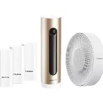

# Netatmo
NetatmoHome vous donne le pouvoir de surveiller l'environnement de votre maison

This plugin is an add-on for the [A.V.A.T.A.R](https://avatar-home-automation.github.io/docs) framework.

🎯 Usage
Commandes :

le comfort de la maison.

creer une app ici : https://dev.netatmo.com/apidocumentation/general

# Multi-room
The Netatmo plugin is fully multi-room.

# Multi-language
The Netatmo plugin relies solely on the system's available languages.

 <table style="border: none;">
  <tr>
    <td style="border: none;"></td>
    <td style="border: none;">
      <h1 style="margin: 0;color: brown;">Netatmo</h1>
      <h3 style="margin: 0;">Get Temperature</h3>
    </td>
  </tr>
</table>
